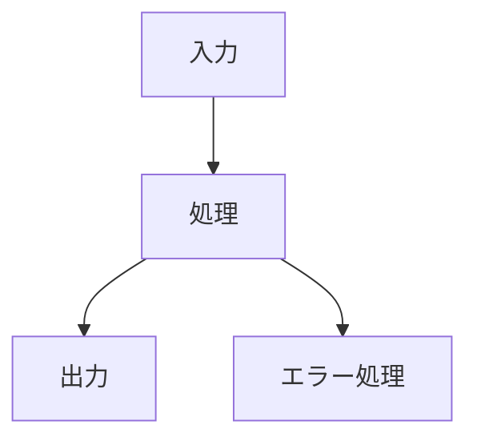

# ブログスタイルガイド

このガイドラインは、ブログ記事の執筆における統一されたスタイルと品質基準を定義します。

## トーンと文体

### 基本原則
- **です・ます調**を使用し、親しみやすい文体で書く
- 専門用語は適切に解説を加える
- 読者に対して直接語りかけるような書き方
- 箇潔で分かりやすい表現を心がける

### 禁止事項
- 過度に hard sell な表現
- 不明確な表現やあいまいな言い回し
- 不要な敬語の乱用
- 漢字の多用（読みやすさを優先）

## 構成ガイドライン

### 記事構成
1. **イントロダクション**: 記事の概要と読者が得られるメリット
2. **ターゲット读者**: 誰向けの記事かを明確にする
3. **目次**: 記事の構成を示す
4. **本文**: メインコンテンツ（セクションごとに H2, H3 を使用）
5. **まとめ**: 記事の要点を整理
6. **参考文献**: ソースやリンク

### 見出し規則
- H1: 記事タイトル（1つのみ）
- H2: 主要セクション
- H3: サブセクション
- H4-H6: 通常は使用しない

## Mermaid ダイアグラムガイドライン

### 使用場面
- ワークフローやフローの可視化
- 概念間の関係性の説明
- アーキテクチャの説明
- タイムラインの表示

### 作成原則
- シンプルで分かりやすい構成
- 必要最小限のノード
- 明確なラベル
- 適切な色使い（必要に応じて）

### 例

## SEO 最適化ルール

### タイトル
- 30文字以上60文字以内
- キーワードを含める
- 読者の興味を引く表現

### 説明 (Description)
- 120文字以上160文字以内
- 記事の内容を端的にまとめる
- 検索エンジンに最適化された表現

### 本文
- キーワードを自然に織り込む
- 見出しの階層を正しく構築
- 内部リンクを適切に設定
- 画像には必ず alt テキストを設定

## 品質基準

### 必須チェック項目
- [ ] タイトルが適切な長さ (30-60文字)
- [ ] 説明が適切な長さ (120-160文字)
- [ ] 見出し構造が正しい
- [ ] 画像に alt テキストが設定されている
- [ ] フロントマターが完備されている
- [ ] コードサンプルが動作する
- [ ] 情報が正確である
- [ ] 文体が統一されている

### 推奨チェック項目
- [ ] Mermaid ダイアグラムが含まれている
- [ ] 参考文献が明記されている
- [ ] 内部リンクが設定されている
- [ ] 画像が最適化されている
