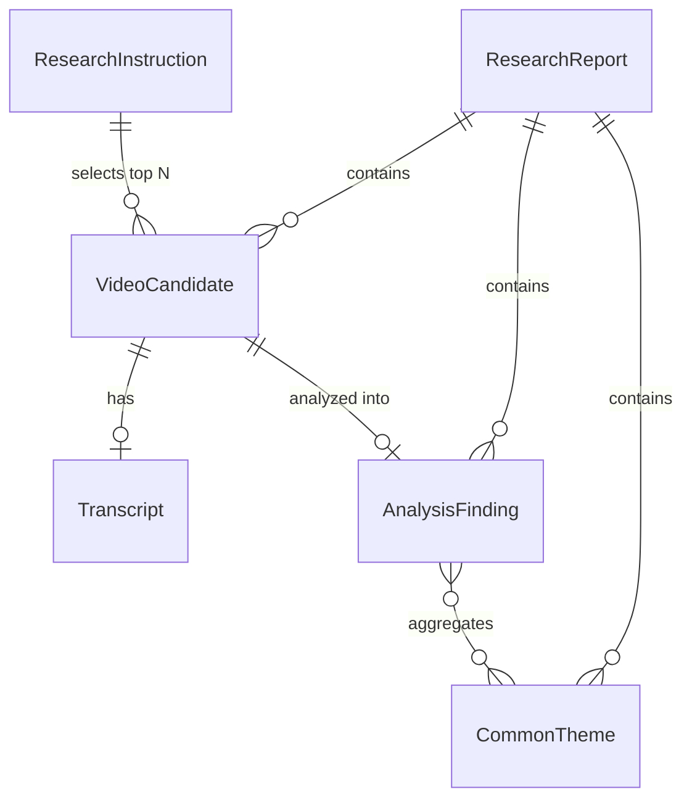
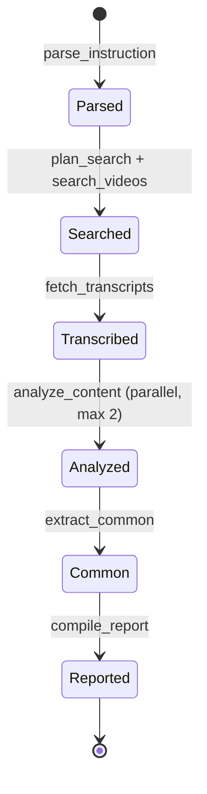

# Data Model: YouTube Trend Researcher

**Created**: 2026-08-26 (updated 2026-08-27)
**Feature**: [spec.md](./spec.md)
**Plan**: [plan.md](./plan.md)

LangGraph State および中間/最終成果物として扱うエンティティを定義する。すべて `pydantic` モデルで表現し、ファイルキャッシュへ JSON 永続化する（DB なし）。v1 簡素化（トレンド判定なし・Whisper なし・CLI のみ・ブログ参考向け）に準拠。

---

## Entities

### ResearchInstruction
ユーザー指示を構造化したもの（LLM が `parse_instruction` で抽出）。

| フィールド | 型 | 説明 |
|-----------|----|------|
| raw_text | str | 元の自然言語指示 |
| topic | str | リサーチ対象トピック（LLM が抽出・補正） |
| max_results | int | 解析対象件数（指示にあればその値、なければ既定 5） |
| output | OutputSpec | 出力指定 |

#### OutputSpec
| フィールド | 型 | 説明 |
|-----------|----|------|
| format | "markdown" \| "json" | 出力形式（既定 markdown） |
| table_for | list[str] | 表で出力すべき項目（例：["common_points"]） |

### VideoCandidate
yt-dlp（`ytsearchN:`）から取得した動画。関連度順の上位 N 件を採用（トレンド判定・velocity 絞り込みなし）。

| フィールド | 型 | 説明 |
|-----------|----|------|
| video_id | str | YouTube 動画ID |
| title | str | タイトル |
| url | str | `https://www.youtube.com/watch?v={video_id}` |
| channel_id | str | チャンネルID |
| channel_title | str | チャンネル名 |
| published_at | datetime \| None | 投稿日時（UTC、取得できれば） |
| view_count | int \| None | 再生数 |
| like_count | int \| None | 高評価数 |
| relevance_rank | int | 検索結果における関連度順位（1 が最上位） |

### Transcript
| フィールド | 型 | 説明 |
|-----------|----|------|
| video_id | str | 対象動画ID |
| language | str | 言語コード（例：ja） |
| text | str | 文字起こし全文（字幕なし時は空またはメタデータ要約） |
| source | "caption" \| "automatic_caption" | 取得手段（v1 は Whisper なし、原則として必ず取得） |

### AnalysisFinding
個別動画のブログ執筆向け要約。

| フィールド | 型 | 説明 |
|-----------|----|------|
| video_id | str | 対象動画ID |
| summary | str | 「ブログでどう扱えるか」の観点での要約 |
| key_points | list[str] | ブログで取り上げられそうなポイント |
| evidence | list[str] | 根拠となる文字起こし抜粋（出典紐付け用） |

### CommonTheme
複数動画間の共通ネタ。

| フィールド | 型 | 説明 |
|-----------|----|------|
| theme | str | テーマ名 |
| description | str | 説明 |
| supporting_video_ids | list[str] | 該当動画ID |
| example_quotes | list[str] | 代表抜粋 |

### ResearchReport（最終アウトプット）
| フィールド | 型 | 説明 |
|-----------|----|------|
| instruction | ResearchInstruction | 入力指示（構造化） |
| generated_at | datetime | 生成日時 |
| candidates | list[VideoCandidate] | 選定動画リスト（関連度順上位 N 件） |
| analyses | list[AnalysisFinding] | 個別ブログ向け要約 |
| common_themes | list[CommonTheme] | 共通ネタ（表出力の元） |
| sources | list[str] | 出典 URL |
| notes | list[str] | 前提・例外（字幕取得不能時等） |

---

## Relationships

---

## State Transitions（LangGraph State）

**状態の不変条件**:
- `Searched` 段階では、yt-dlp 検索結果の関連度順上位 N 件（既定 5）を採用。トレンド判定・velocity 絞り込みは行わない。
- `Transcribed` 段階では、yt-dlp の自動翻訳字幕で原則として必ず字幕テキストが取得できる。取得不能時のみ `notes` に記録。
- `Analyzed` 段階では、各動画を「ブログ執筆の参考」として要約（FR-007）。
- `Reported` 段階の `ResearchReport.sources` は `candidates` の URL を全て含む。
- 全体実行が 100 分を超過した場合、`Reported` は途中結果（部分的 report）として返される。

---

## Validation Rules（要件マッピング）

- **FR-005（件数選定）**: `max_results` 件の関連度順上位動画を採用。指示なしは既定 5。トレンド判定・投稿日窓・登録者数閾値は行わない。
- **FR-006（字幕）**: `source` が `caption` / `automatic_caption`（自動翻訳含む）。Whisper は非利用。原則として必ず取得可能。言語は設定から決定（既定 ja）。
- **FR-007（ブログ向け要約）**: `summary` / `key_points` として集約。プロンプトで「ブログ執筆の参考」の観点を指示。
- **FR-008（共通ネタ）**: `common_themes` として集約。`supporting_video_ids` で根拠動画を紐付け。
- **FR-009（出力形式）**: `OutputSpec.format` に従い markdown/json を生成。表指定は `common_themes` から構成。執筆ヒントは含めない。
- **FR-012（永続化）**: 各エンティティは `cache/` 配下の JSON に書き出し、再現性を担保。
- **FR-013（進捗表示）**: 各ノード開始・完了を stderr へ出力。State 遷移と進捗出力は 1:1 に対応。
