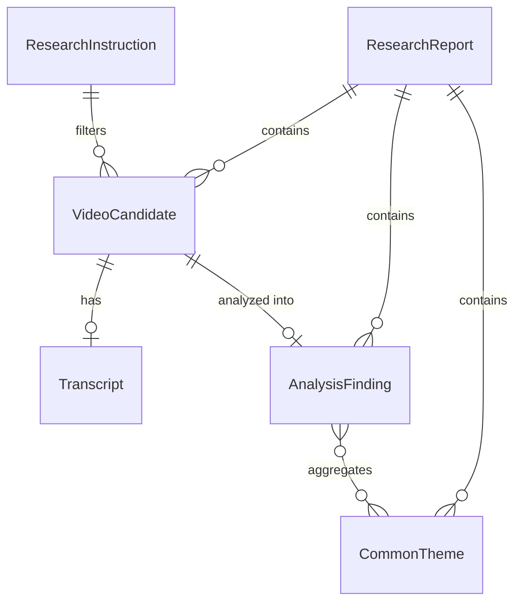
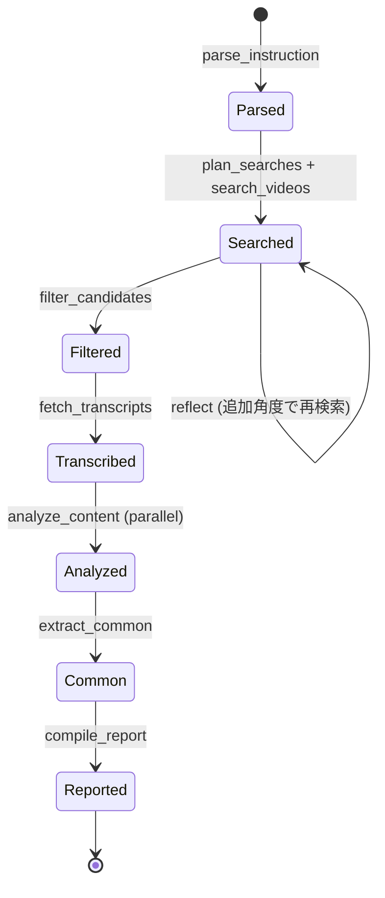

# Data Model: YouTube Trend Researcher

**Created**: 2026-08-26
**Feature**: [spec.md](./spec.md)
**Plan**: [plan.md](./plan.md)

LangGraph State および中間/最終成果物として扱うエンティティを定義する。すべて `pydantic` モデルで表現し、ファイルキャッシュへ JSON 永続化する（DB なし）。

---

## Entities

### ResearchInstruction
ユーザー指示を構造化したもの（LLM が `parse_instruction` で抽出）。

| フィールド | 型 | 説明 |
|-----------|----|------|
| raw_text | str | 元の自然言語指示 |
| topic | str | リサーチ対象トピック（例：「Claude Code で会社を回す方法」） |
| filters | InstructionFilters | 絞り込み条件 |
| output | OutputSpec | 出力指定 |

#### InstructionFilters
| フィールド | 型 | 説明 | 検証 |
|-----------|----|------|------|
| published_after | date \| None | 投稿日窓の下限（例：直近半年） | ISO 日付 |
| published_before | date \| None | 投稿日窓の上限 | ISO 日付 |
| subscriber_max | int \| None | 登録者数上限（「少ない」の閾値） | >= 0 |
| views_min | int \| None | 再生数下限（「伸びている」の閾値） | >= 0 |
| velocity_ratio | float \| None | 登録者数比較（再生/登録者）下限 | > 0 |
| max_results | int | ピックアップ件数（例：10） | 1..50 |
| relevance_keywords | list[str] | 関連性判定用キーワード | — |

#### OutputSpec
| フィールド | 型 | 説明 |
|-----------|----|------|
| format | "markdown" \| "json" | 出力形式（既定 markdown） |
| table_for | list[str] | 表で出力すべき項目（例：["common_points"]） |

### VideoCandidate
yt-dlp（`ytsearch`/`ytsearchdate`）から取得し、フィルタを通した動画（YouTube Data API はオプションの登録者数フォールバックのみ）。

| フィールド | 型 | 説明 |
|-----------|----|------|
| video_id | str | YouTube 動画ID |
| title | str | タイトル |
| url | str | `https://www.youtube.com/watch?v={video_id}` |
| channel_id | str | チャンネルID |
| channel_title | str | チャンネル名 |
| published_at | datetime | 投稿日時（UTC） |
| view_count | int | 再生数 |
| like_count | int \| None | 高評価数 |
| subscriber_count | int \| None | チャンネル登録者数 |
| relevance_score | float | トピック関連度（0..1） |

### Transcript
| フィールド | 型 | 説明 |
|-----------|----|------|
| video_id | str | 対象動画ID |
| language | str | 言語コード（例：ja） |
| text | str | 文字起こし全文 |
| source | "caption" \| "whisper" | 取得手段 |

### AnalysisFinding
個別動画の分析結果。

| フィールド | 型 | 説明 |
|-----------|----|------|
| video_id | str | 対象動画ID |
| trending_reason | str | 「伸びている理由」の要約 |
| evidence | list[str] | 根拠となる文字起こし抜粋（出典紐付け用） |

### CommonTheme
複数動画間の共通点。

| フィールド | 型 | 説明 |
|-----------|----|------|
| theme | str | テーマ名 |
| description | str | 説明 |
| supporting_video_ids | list[str] | 該当動画ID |
| example_quotes | list[str] | 代表抜粋 |

### ResearchReport（最終アウトプット）
| フィールド | 型 | 説明 |
|-----------|----|------|
| instruction | ResearchInstruction | 入力指示（構造化） |
| generated_at | datetime | 生成日時 |
| candidates | list[VideoCandidate] | 選定動画リスト |
| analyses | list[AnalysisFinding] | 個別分析 |
| common_themes | list[CommonTheme] | 共通点（表出力の元） |
| sources | list[str] | 出典 URL |
| notes | list[str] | 前提・例外（字幕欠損等） |

---

## Relationships

---

## State Transitions（LangGraph State）

**状態の不変条件**:
- `Filtered` 段階では `InstructionFilters` が全件に適用済み（既定: velocity ≥ 10.0、直近半年以内）。`subscriber_count=None` の動画は事前除外済み。
- `Transcribed` 段階では、字幕不在動画は Whisper（GPU）で転写試行。Whisper 失敗時のみ `notes` に記録しメタデータ分析へ切り替え。
- `Reported` 段階の `ResearchReport.sources` は `candidates` の URL を全て含む。
- 全体実行が 100 分を超過した場合、`Reported` は途中結果（部分的 report）として返される。

---

## Validation Rules（要件マッピング）

- **FR-005（フィルタ）**: `published_after/before` で投稿日を（`upload_date` パースで絞り込み）、`subscriber_max/views_min/velocity_ratio` で登録者・再生の関係を判定。既定 velocity ≥ 10.0、直近半年（180日）以内。
- **FR-004（取得）**: 取得元は yt-dlp 主体。`channel_follower_count` が非公開の場合は `subscriber_count=None` とし、`notes` に記録（YouTube Data API オプションで補完可）。
- **FR-006（文字起こし）**: `source` が `caption` 優先、`whisper`（GPU 前提）はフォールバック。言語は `OutputSpec`/設定から決定。
- **FR-008（共通点）**: `common_themes` として集約。`supporting_video_ids` で根拠動画を紐付け。v1 は動画本文（字幕/Whisper）のみ、コメントは未使用。
- **FR-009（出力形式）**: `OutputSpec.format` に従い markdown/json を生成。表指定は `common_themes` から構成。
- **LLM 出力**: 構造化出力強制はせず、`tools/parse.py` で Markdown/JSON を抽出（Clarification）。
- **FR-012（永続化）**: 各エンティティは `cache/` 配下の JSON に書き出し、再現性を担保。
