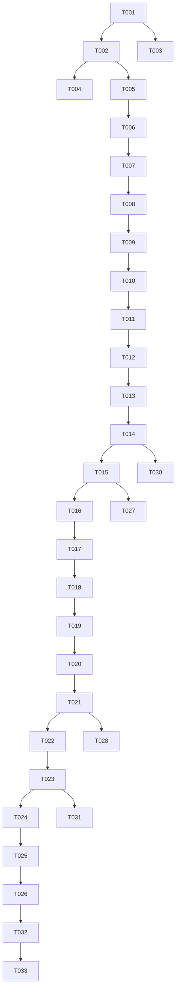

# Tasks: YouTube Trend Researcher

**Input**: Design documents from `/specs/002-youtube-trend-researcher/` (plan.md, spec.md, research.md, data-model.md, contracts/, quickstart.md)

**Prerequisites**: plan.md (required), spec.md (required), research.md, data-model.md, contracts/ ✅ all present

**Tests**: Included in Polish phase. Constitution IV mandates tests for all tools, and quickstart.md defines pytest validation (Scenario A–C). Test tasks are placed in the Polish phase.

**Organization**: Tasks grouped by user story so each story can be implemented/tested/delivered independently. US2 (multiple-angle search) is **deferred to future expansion** (P4) and excluded from v1 — see Deferred phase.

## Format: `[ID] [P?] [Story] Description`

- **[P]**: Can run in parallel (different files, no dependencies)
- **[Story]**: User story this task belongs to (US1–US4)
- Exact file paths included in descriptions

## Path Conventions

Single project under `youtube_trend_researcher/` (lowercase, top dir included — 2026-08-27 clarification):
- `src/youtube_trend_researcher/` — package
- `tests/unit/`, `tests/integration/` — tests
- `cache/` — intermediate artifacts (DB-free persistence, FR-012)

---

## Phase 1: Setup (Shared Infrastructure)

**Purpose**: Project initialization and basic structure

- [ ] T001 Create project directory structure `youtube_trend_researcher/` with `src/youtube_trend_researcher/`, `tests/unit/`, `tests/integration/`, `cache/` per plan.md project structure
- [ ] T002 [P] Create `youtube_trend_researcher/pyproject.toml` with dependencies: `langgraph`, `langchain`, `langchain-openai`, `yt-dlp`, `pydantic`, `python-dotenv`; dev: `pytest`, `ruff`, `mypy` (mirror `blog_writer/pyproject.toml` layout). NOTE: `openai-whisper` and `google-api-python-client` are **excluded** (Data API / Whisper not used in v1).
- [ ] T003 [P] Create `youtube_trend_researcher/.env.example` with `OPENAI_API_KEY`, `OPENAI_BASE_URL=https://opencode.ai/zen/go/v1`, `YTR_MODEL=openai:mimo-v2.5` (research.md R-3). No `YOUTUBE_API_KEY` (YouTube Data API not used).
- [ ] T004 [P] Configure ruff and mypy in `youtube_trend_researcher/pyproject.toml` (`[tool.ruff]`, `[tool.mypy]`) per Constitution IV

**Checkpoint**: Project scaffold and dependency manifest ready.

---

## Phase 2: Foundational (Blocking Prerequisites)

**Purpose**: Core infrastructure that MUST complete before ANY user story

- [ ] T005 [P] Implement `src/youtube_trend_researcher/config.py` — `Config` pydantic model (openai_api_key, openai_base_url, model, cache_dir, transcript_language, max_retries) loading from env/.env. No `youtube_api_key` field (Data API not used).
- [ ] T006 [P] Implement `src/youtube_trend_researcher/tools/llm.py` — `build_model(role)` mirroring OpenDeepResearch: `init_chat_model(model, max_tokens, api_key, base_url)` with `configurable_fields=("model","max_tokens","api_key")`; default `openai:mimo-v2.5` @ `OPENAI_BASE_URL` (research.md R-3)
- [ ] T007 [P] Implement `src/youtube_trend_researcher/models.py` — Pydantic entities per data-model.md: `ResearchInstruction` (raw_text, topic, max_results, output), `OutputSpec`, `VideoCandidate` (no subscriber_count/relevance_score; add relevance_rank), `Transcript` (source=`caption`|`automatic_caption`), `AnalysisFinding` (blog summary), `CommonTheme`, `ResearchReport`
- [ ] T008 [P] Implement `src/youtube_trend_researcher/tools/youtube_search.py` — yt-dlp based single search via `ytsearchN:` (N from instruction max_results, default 5); map results to `VideoCandidate` (view_count, upload_date, channel fields, like_count). No `channel_follower_count`, no exclusion logic, no velocity (research.md R-1, FR-003/FR-004/FR-005)
- [ ] T009 [P] Implement `src/youtube_trend_researcher/tools/transcript.py` — yt-dlp `subtitles`/`automatic_captions` (auto-translate fallback) only; return `Transcript(source="caption"|"automatic_caption")`. No Whisper (FR-006). Subtitles are assumed always retrievable via auto-translate.
- [ ] T010 [P] Implement `src/youtube_trend_researcher/tools/parse.py` — lightweight parser extracting structured data (Markdown/JSON) from LLM outputs for downstream nodes (prompt-driven, not forced structured output)
- [ ] T011 [P] Implement `src/youtube_trend_researcher/prompts.py` — centralized LLM prompt strings for `parse_instruction`, `plan_search`, `analyze_content` (blog-writing reference angle), `extract_common`, `compile_report` (plan.md node graph)
- [ ] T012 [P] Implement cache persistence helper in `src/youtube_trend_researcher/cache.py` — `write_json`/`read_json` to `cache/` for intermediate artifacts (candidates, transcripts, analyses) (FR-012)
- [ ] T013 Implement `src/youtube_trend_researcher/progress.py` — node progress emitter writing to stderr: `emit(node_index, total, node_name, phase)` printing `[n/7] <node> ... 開始|完了`. Used by all nodes to satisfy FR-013 (no blank gap between progress and final result)
- [ ] T014 Implement `src/youtube_trend_researcher/state.py` — LangGraph `State` (instruction, candidates, transcripts, analyses, common_themes, report, notes) per data-model.md graph transitions

**Checkpoint**: Foundation ready — user story implementation can now begin.

---

## Phase 3: User Story 1 - 自然言語指示からの自律リサーチ実行 (Priority: P1) 🎯 MVP

**Goal**: Given a natural-language instruction, autonomously run parse → plan_search → search → fetch → analyze → extract_common → compile, returning a final `ResearchReport` with no human input.

**Independent Test**: `python -m youtube_trend_researcher "Claude Code で会社を回す方法を解説している動画を参考にブログを書きたい"` returns a Markdown report with selected video list + per-video summaries + common-net table (SC-001, SC-002).

- [ ] T015 [US1] Implement `src/youtube_trend_researcher/nodes/parse_instruction.py` — LLM extracts structured `ResearchInstruction` (topic, max_results default 5, output) from raw text; emit progress start/complete via `progress.py` (FR-001)
- [ ] T016 [US1] Implement `src/youtube_trend_researcher/nodes/plan_search.py` — LLM generates ONE search query from instruction (topic selection delegated to LLM, Q4); emit progress; no multi-angle (FR-003)
- [ ] T017 [US1] Implement `src/youtube_trend_researcher/nodes/search_videos.py` — run single `ytsearchN:` search via `tools/youtube_search.py` using query from plan_search; take top N by relevance (no trend/velocity filter); emit progress (FR-003/FR-005)
- [ ] T018 [US1] Implement `src/youtube_trend_researcher/nodes/fetch_transcripts.py` — for selected candidates, fetch transcripts via `tools/transcript.py` (auto-translate; assumed always available); emit progress (FR-006)
- [ ] T019 [US1] Implement `src/youtube_trend_researcher/nodes/analyze_content.py` — LLM per-video blog-writing-reference summary (`summary`, `key_points`, `evidence`) from transcript, parsed via `tools/parse.py`; **max 2 concurrent LLM calls**; emit progress (FR-007)
- [ ] T020 [US1] Implement `src/youtube_trend_researcher/nodes/extract_common.py` — LLM aggregate `AnalysisFinding`s into `CommonTheme` list (blog common-net) using transcripts only (no comments); emit progress (FR-008)
- [ ] T021 [US1] Implement `src/youtube_trend_researcher/nodes/compile_report.py` — assemble `ResearchReport` (candidates, analyses, common_themes, sources, notes), default markdown; emit progress (FR-009/FR-010)
- [ ] T022 [US1] Implement `src/youtube_trend_researcher/graph.py` — wire `StateGraph` parse→plan_search→search→fetch→analyze→extract→compile→END (single search) and provide `run()` entry. Add overall execution time monitor: abort at 100 min (Clarification) and return partial `ResearchReport` for completed candidates/analyses (SC-005, Edge Case: timeout)
- [ ] T023 [US1] Implement `src/youtube_trend_researcher/__init__.py` skeleton `research()` that invokes graph and returns `ResearchReport` (full flow, US1 MVP)

**Checkpoint**: `python -m youtube_trend_researcher "<instruction>"` produces a full report end-to-end (SC-001).

---

## Phase 4: User Story 3 - 外部リクエスト・実行・アウトプット取得のインターフェース (Priority: P2)

**Goal**: CLI entry that accepts an instruction and returns the structured report; progress on stderr, report on stdout/file.

**Independent Test**: Run via CLI with `--format markdown` and `--output out.md`; assert exit 0 and report file written; stderr shows `[1/7]`..`[7/7]` progress (contracts/cli.md).

- [ ] T024 [US3] Implement `src/youtube_trend_researcher/__main__.py` CLI — argparse for `INSTRUCTION`, `--output`, `--format {markdown,json}`, `--max-results` (default 5), `--lang` (default ja), `--cache-dir`; exit codes 0/1/2 per contracts/cli.md. Handle FR-011 error cases: 0 candidates → "該当なし" message; network failure → retry/backoff then user-friendly stderr message; report actual found count when below requested (Edge Cases).
- [ ] T025 [US3] Wire `progress.py` output to stderr and final report to stdout (or `--output` file) in `__main__.py` so progress and result never collapse into a blank gap (FR-013)
- [ ] T026 [US3] Document CLI usage in `youtube_trend_researcher/README.md` per contracts/cli.md (command, options, progress format, exit codes)

**Checkpoint**: CLI usable as the sole interface; programmatic API deferred.

---

## Phase 5: User Story 4 - 件数指定と多様な出力形式 (Priority: P3)

**Goal**: Interpret NL count from instruction; support markdown/json output and common-net table.

**Independent Test**: `--max-results 10` selects top 10; `--format json` writes report-schema.json; common-net appears as a table in markdown (SC-003, SC-004).

- [ ] T027 [US4] Enhance `src/youtube_trend_researcher/nodes/parse_instruction.py` to interpret NL count ("10個" etc.) into `max_results` (default 5 when unspecified) (FR-005, SC-003)
- [ ] T028 [US4] Enhance `src/youtube_trend_researcher/nodes/compile_report.py` to support `--format json` (report-schema.md) and markdown table for `common_themes` (FR-009, SC-004)

**Checkpoint**: Count override and output formats verified.

---

## Phase 6: Deferred — User Story 2 (Priority: P4, Future Expansion)

**Note**: Multi-angle autonomous exploration (plan_searches / reflect loop) is **explicitly deferred to a future phase** (2026-08-27 clarification). v1 uses a single LLM-generated query only. No implementation tasks in v1.

- [ ] T029 [US2] (FUTURE) Design note only: when implementing, add `nodes/plan_searches.py` for multiple-angle query generation and a reflect loop in `graph.py`. Not built in v1.

---

## Phase 7: Polish & Cross-Cutting Concerns

- [ ] T030 [P] Unit tests in `youtube_trend_researcher/tests/unit/` for `tools/llm.py`, `tools/youtube_search.py`, `tools/transcript.py`, `tools/parse.py`, `models.py` (mock yt-dlp / LLM)
- [ ] T031 [P] Integration test in `youtube_trend_researcher/tests/integration/` covering quickstart.md Scenario A (default 5, markdown), B (max-results 10, json), C (subtitle retrieval) using recorded fixtures
- [ ] T032 [P] Documentation in `youtube_trend_researcher/README.md` — architecture diagram (plan.md node graph), `.env.example` notes, progress display design (FR-013)
- [ ] T033 [P] Verify Constitution IV compliance: ruff clean, mypy clean, all modules importable; `python -m youtube_trend_researcher --help` exits 0

---

## Dependencies

## Parallel Execution Examples

- **Phase 2 foundation**: T005–T012 are independent file creations → run in parallel (mark [P]).
- **Per-story**: Within US1, node implementations T015–T021 can be coded in parallel once T014 (state) and T007 (models) exist; graph wiring T022 depends on all nodes.
- **Polish**: T030, T031, T032, T033 are independent → parallel.

## Implementation Strategy

- **MVP first**: Phase 3 (US1) delivers the core autonomous flow — the primary value.
- **Incremental**: Add CLI (US3), then count/format (US4). US2 deferred.
- **Suggested MVP scope**: Phase 1 + Phase 2 + Phase 3 (T001–T023). This yields a working `python -m youtube_trend_researcher` end-to-end.
- **Cross-cutting**: Tests and docs in Phase 7; run ruff/mypy early and often (Constitution IV).

## Format Validation

All tasks follow the checklist format: checkbox `- [ ]`, sequential Task ID (T001..T033), `[P]` marker for parallelizable, `[USn]` label on user-story-phase tasks, and explicit file paths. ✅
